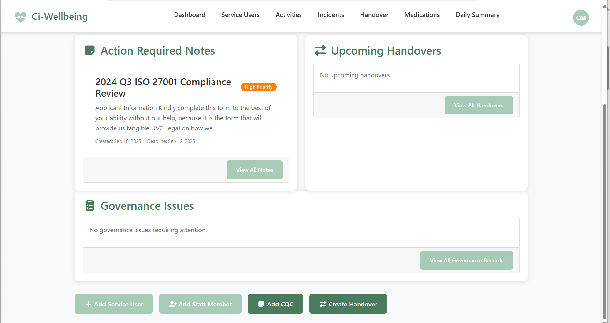
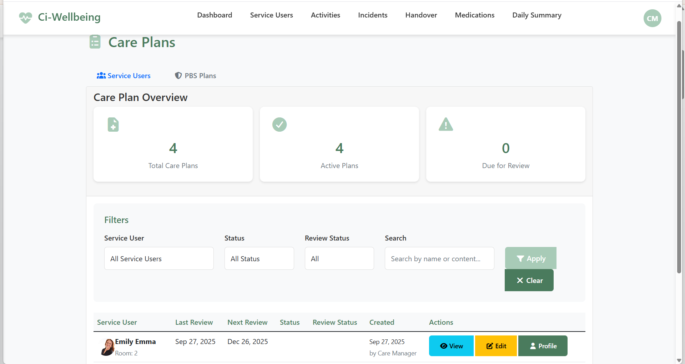
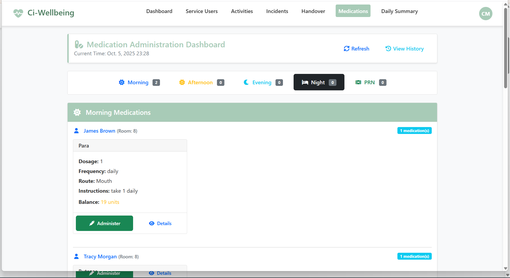
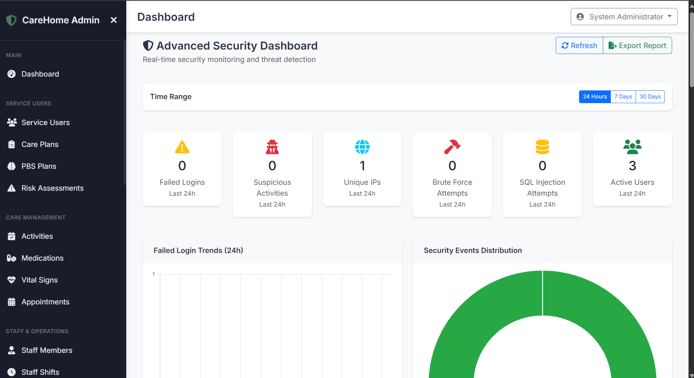

# 🏥 Ci-Wellbeing - Django Healthcare Management System  

A **secure healthcare management application** built with **Django**, designed for care homes to manage **service users, healthcare workers, and daily activities**.  
This project focuses not only on **care delivery & documentation** but also on **cybersecurity monitoring** to detect and mitigate different types of cyber attacks.  

---

## 🚀 Key Features  

- 🔐 **User Authentication & Roles** (Admin, Management, Staff, CQC Members)  
- 📝 **Care Plan Management** (Create, update, and track service user care plans)  
- 🧠 **PBS Plan Updates** for personalized behavior support  
- 💊 **Medication Administration Records (MARs)**  
- ⚠️ **Incident Reporting & Tracking**  
- 📊 **Dashboards** (Management, Staff, CQC, Admin)  
- 🛡️ **Security Dashboard** with real-time monitoring of:  
  - Failed login attempts  
  - Suspicious activities  
  - Unauthorized access attempts  
  - Role-based access logs  
- 🛠️ **Audit Logging** for compliance & accountability  
- 📑 **Reports Generation** for CQC and management reviews  
- 🎨 Responsive UI with **Bootstrap 5 & Custom Styling**  

---

## 🔒 Security First  

Unlike traditional healthcare apps, **Ci-Wellbeing** is built with **security as a core feature**:  
- Monitors logins & access attempts  
- Alerts admins of suspicious behavior  
- Designed to mitigate brute-force, session hijacking, and privilege escalation attacks  
- Role-based redirection to appropriate dashboards  

---

## 📸 Screenshots  

### 👩‍⚕️ Staff Dashboard  
  

### 📑 Care Plan Management  
  

### 💊 Medication Administration  
  

### 🛡️ Security Dashboard  
  

---

## 🎥 Demo Video  

▶️ [Watch Demo on YouTube](https://www.youtube.com/your-demo-link)  

---

## ⚙️ Tech Stack  

- **Backend:** Django, Python  
- **Frontend:** HTML, CSS, Bootstrap 5  
- **Database:** SQLite (development) / PostgreSQL or MySQL (production)  
- **Security:** Django Middleware, Logging, Custom Security Handlers  
- **Version Control:** Git & GitHub  
- **Deployment:** Docker / Gunicorn + Nginx (recommended)  

---

## 🛠️ Installation & Setup  

```bash
# Clone the repository
git clone https://github.com/cipher0411/healthcare.git
cd cipherknights-careapp

# Create virtual environment
python -m venv venv
source venv/bin/activate  # on Linux/Mac
venv\Scripts\activate     # on Windows

# Install dependencies
pip install -r requirements.txt

# Run migrations
python manage.py migrate

# Start development server
python manage.py runserver


📜 License & Ownership

This project is a product of Cipher Knights 🛡️.
You are free to use, modify, and extend the system for your own care organization, but you must retain credits to Cipher Knights as the original creator.


🤝 Contribution

We welcome contributions from developers and healthcare IT experts!

Fork the repo

Create a new branch (feature-xyz)

Submit a pull request


👨‍💻 Author

Cipher Knights
🔗 www.cipherknights.com


---

✨ Next Step: You just need to add your **screenshots** in a `docs/images/` folder and upload your **demo video to YouTube**, then replace the placeholder links.  

Would you like me to also include a **badge section** at the top (like Build Status, Python Version, License, etc.) to make it look even more professional?
